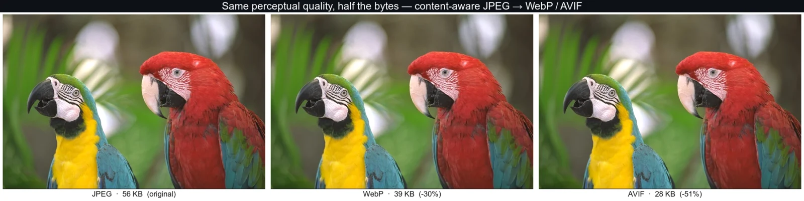

# image-tools

> **Content-aware JPEG → WebP / AVIF conversion.** Point it at a JPEG, get back a smaller
> WebP or AVIF at the same perceptual quality — no hand-tuning, no per-image judgment calls.

<!-- Replace OWNER with your GitHub username/org after pushing, to activate the CI badge. -->
[](https://github.com/OWNER/image-tools/actions/workflows/ci.yml)
[](LICENSE)




*Same image, same perceptual quality (SSIMULACRA2 ≈ 80 vs the source), at a fraction of the bytes.*

**▶ [Try it in your browser](https://OWNER.github.io/image-tools/web/)** — drop a JPEG, compare
WebP/AVIF, nothing uploaded. (Or run the CLI below.)

```bash
# Fast mode needs only two encoders — no Python, no ImageMagick, no ssimulacra2.
brew install webp libavif                      # or: apt install webp libavif-bin

node convert.mjs photo.jpg out/                # → out/photo.avif (or .webp), whichever is smaller
```

Why it's not just "pick quality 60": a JPEG quality 80 *photo*, *illustration*, and *line-art*
scan each need a **different** WebP/AVIF quality to preserve equivalent perceptual quality. This
ships pre-computed calibration curves (1% resolution, 10 perceptual metrics × 3 content types)
that capture exactly how different, so every conversion lands at the right quality automatically.

## How it works

1. **Classify** the image by content type (photo / illustration / line-art / pixel-art).
2. **Look up** the calibrated WebP/AVIF quality for that content type and the input JPEG's
   detected quality (read straight from the file — no ImageMagick needed).
3. **Encode** WebP and AVIF and ship whichever is smaller — and never larger than the source.

That's the default **fast** path (just `cwebp` + `avifenc`). Add **`--verify`** for a per-image
guarantee: it binary-searches the lowest quality whose encode clears an absolute
[SSIMULACRA2](https://github.com/cloudinary/ssimulacra2) floor vs the source JPEG — accurate and
classification-independent, at the cost of needing `ssimulacra2` and more time.

## Requirements

The converter is deliberately light. Dependencies scale with what you do:

- **Fast mode (default conversion)** — **`cwebp`** (libwebp) + **`avifenc`** (libavif) on your
  `PATH`. That's it. No Python, no ImageMagick, no ssimulacra2. JPEG quality is read directly
  from the file.
- **`--verify` mode** — additionally **`ssimulacra2`** (libjxl devtools), plus `avifdec`/`dwebp`
  (ship with libavif/libwebp) or ImageMagick to decode candidates for scoring.
- **`--contact-sheet`** — **ImageMagick 7** (`magick`), for the comparison montage only.
- **Regenerating the curves** — see [`calibration/`](calibration/); needs the full toolchain
  (ssimulacra2, butteraugli, dssim, ffmpeg, ImageMagick, a PyTorch venv). **You never need this
  to use the converter** — the curves are already generated and committed.

Node.js (ESM, no npm dependencies). On macOS the encoders are `brew install webp libavif`;
`ssimulacra2` comes from a libjxl build with devtools enabled (only needed for `--verify`).

## Setup

Conversion and classification need **no installation** beyond `cwebp` + `avifenc`:

```bash
git clone https://github.com/OWNER/image-tools && cd image-tools
node convert.mjs photo.jpg out/
# or run it straight from GitHub without cloning:
npx -p github:OWNER/image-tools img-convert photo.jpg out/
```

No npm install step — there are no JavaScript dependencies. (The package isn't on the npm
registry; use the repo directly, or the zero-install [web demo](#).) Everything for *regenerating*
curves (the Python venv, etc.) lives in [`calibration/`](calibration/) and isn't needed to use the tool.

## Datasets

**Source images are not bundled** in this repo (they're large, and the illustration/line-art
sets are third-party content). The committed calibration JSONs contain only numbers, so you can
use `classify.mjs` / `convert.mjs` immediately without any images.

To re-run calibration you supply your own datasets under `test-images/<type>/`:
- **photo** — the [Kodak lossless set](https://r0k.us/graphics/kodak/) (24 public-domain-style benchmark PNGs)
- **illustration / line-art** — bring your own (flat-color artwork; black-and-white ink/pencil art)

## Usage

### Convert a JPEG

```bash
node convert.mjs input.jpg output-dir/                       # FAST: encode at the calibrated quality
node convert.mjs photos/ output-dir/                         # BATCH: every JPEG in a folder, in parallel
node convert.mjs input.jpg output-dir/ --verify              # binary-search to an absolute SSIMULACRA2 floor
node convert.mjs input.jpg output-dir/ --dry-run             # preview the plan without writing
node convert.mjs input.jpg output-dir/ --type illustration   # override content type
node convert.mjs input.jpg output-dir/ --keep-both           # write both WebP and AVIF winners
node convert.mjs input.jpg output-dir/ --contact-sheet       # also write a visual comparison PNG
```

Point it at a **directory** to batch-convert every JPEG in parallel — each file runs in an
isolated process, so one bad image is reported and skipped rather than crashing the run.

**Two modes.** By default the converter trusts the frozen curves and encodes straight at the
calibrated quality — fast, and dependency-light (just `cwebp` + `avifenc`). **`--verify`** adds
the per-image guarantee: it **binary-searches the lowest quality whose encode clears an absolute
SSIMULACRA2 floor vs the source JPEG** (`--floor`, default 80). This is classification-independent
— the floor means the same thing on every image, so a misclassification can't silently
under-encode — at the cost of needing `ssimulacra2` and being slower (AVIF at `--speed 0`).

Both modes **never bloat**: if no encoding beats the source JPEG at the required quality, the
original is kept (nothing is written) rather than emitting a larger file.

Other flags: `--floor N` (`--verify` fidelity bar; higher = stricter/larger), `--report` (full
candidate table), `--ssim-only` (use only the SSIMULACRA2 curve; `--no-lap` is a deprecated
alias), `--contact-sheet` / `--compare` (write `<stem>-compare.png`: the original JPEG next to the
WebP and AVIF at full size, captioned with file size + SSIMULACRA2 score, so you can eyeball the
result).

### Classify an image

```bash
node classify.mjs image.jpg                # single image -> JSON
node classify.mjs image.jpg --verbose      # include raw signal values
node classify.mjs *.png --batch            # JSON array, progress on stderr
```

### Regenerating calibration curves (optional / archival)

**The curves are already generated and committed — you never need this to use the converter.**
The generator lives in [`calibration/`](calibration/) with its own README; it's kept for
transparency and reproducibility. It's a one-time, multi-hour job needing the full toolchain.

```bash
node calibration/calibrate.mjs \
  --dataset photo:test-images/kodak:. \
  --metrics ssimulacra2,butteraugli,dssim,xpsnr,ms_ssim,lpips,dists,fsim,vif,entropy_diff \
  --step 1
```

It uses every logical CPU core with single-threaded encoders (`--avif-jobs 1`, benchmarked
fastest for many small images), and PyTorch metrics run through persistent worker pools (model
loaded once, not per measurement). See [`calibration/README.md`](calibration/README.md).

## Calibration data

`{metric}-calibration-{content-type}.json` — JPEG→WebP/AVIF quality lookup tables, one per
perceptual metric per content type. Schema and the full list of metrics are documented in
[`calibration-schema.md`](calibration-schema.md). `convert.mjs` loads every curve available for
a content type and takes the most conservative (highest) quality across them as its starting
point.

All curves are **full-resolution (every JPEG quality 1–100)** — ssimulacra2, butteraugli,
dssim, xpsnr, ms_ssim, lpips, dists, fsim, vif, and entropy_diff — across photo, illustration,
and line-art. The one exception is **vmaf**, kept as a coarse 11-point line-art-only curve
(it's intentionally disabled for photo/illustration; see the limitations below).

## Status & known limitations

This is a research toolkit, not a polished release. Current rough edges:

- **AVIF scoring requires a working ImageMagick AVIF (`heic`) delegate.** AVIF candidates are
  scored by decoding to PNG via `magick`; if a Homebrew `libheif` upgrade breaks that delegate,
  AVIF is silently dropped and only WebP is produced. Check with
  `magick -list format | grep -i avif` (should be `rw+`); fix with `brew reinstall imagemagick`.
- **`mixed` content type falls back to the photo curves.** An image the classifier can't
  confidently categorize is converted using the (conservative) photo calibration. Pass an
  explicit `--type` for best accuracy.
- **`vmaf` is calibrated for line-art only** and is otherwise disabled (it saturates at high
  quality and distorts the max-across-curves logic).
- Datasets are small (24 photo / 25 illustration / 19 line-art) and are not bundled (see
  [Datasets](#datasets)).

See [`CLAUDE.md`](CLAUDE.md) for the full as-built notes and gotchas, and
[`blog-post.md`](blog-post.md) for the methodology write-up.

## License

Calibration data is intended for release under CC0 (see `blog-post.md`). No license file is
present yet for the code.
